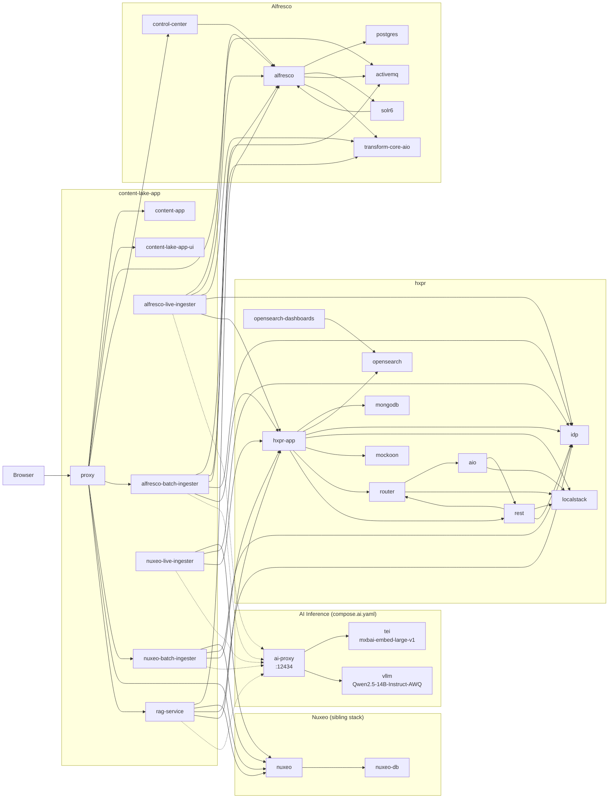

# Deploying to AWS EC2 — g5.2xlarge

This guide covers a fresh deployment of the full stack on a **g5.2xlarge** (8 vCPU / 32 GB RAM /
NVIDIA A10G GPU, 24 GB VRAM) running Ubuntu.

## Why vLLM + TEI instead of Docker Model Runner

**Docker Model Runner** is the default AI backend and works well for local development on Docker
Desktop (Mac and Windows). It is simple to set up and sufficient for single-user interactive use.

For a shared EC2 deployment it has a critical limitation: inference requests are processed
**serially**, one at a time. Under concurrent load -- multiple users querying simultaneously, or a
quality-measurement run that ingests content while serving RAG queries -- requests pile up in a
queue. The symptom is `docker-model-runner` CPU usage above 200% while GPU utilisation stays low:
the GPU finishes each request quickly but the next one has not been dispatched yet.

**vLLM** replaces the LLM backend with *continuous batching*: multiple in-flight requests are fused
into a single GPU kernel dispatch, yielding 3--5x throughput at the same hardware cost.
**HuggingFace TEI** does the same for embeddings, which matters because ingestion jobs and RAG
queries both hit the embedding endpoint concurrently.

The g5.2xlarge's A10G (24 GB VRAM) keeps both models resident simultaneously with no eviction and
no cold starts -- something the smaller T4 (16 GB) cannot do with a 14B-parameter LLM.

A lightweight nginx proxy fronts TEI and vLLM on port **12434** -- the same port Docker Model
Runner uses -- so `MODEL_RUNNER_URL` in `.env.local` does not change and no compose files need
modification.

```
compose services --> MODEL_RUNNER_URL (http://host.docker.internal:12434)
                          |
                     nginx ai-proxy :12434
                     +-- /v1/embeddings --> TEI   :8080  (mxbai-embed-large-v1)
                     +-- /v1/*          --> vLLM  :8000  (Qwen2.5-14B-Instruct-AWQ)
```

**VRAM budget (A10G, 24 GB):**

| Container | Model | Approx. VRAM |
|---|---|---|
| TEI | `mixedbread-ai/mxbai-embed-large-v1` | ~0.7 GB |
| vLLM | `Qwen/Qwen2.5-14B-Instruct-AWQ` (at `--gpu-memory-utilization 0.75`) | ~18 GB |
| **Total** | | **~18.7 GB**, ~5.3 GB headroom |

> `Qwen2.5-14B-Instruct-AWQ` is the vLLM equivalent of Docker Model Runner's `ai/gpt-oss` --
> same parameter class (~14B), 4-bit AWQ quantization, similar reasoning quality.

## 1. Launch the EC2 Instance

| Setting | Value |
|---|---|
| AMI | Ubuntu Server 24.04 LTS (HVM), 64-bit x86 |
| Instance type | `g5.2xlarge` |
| Key pair | Create or select an existing key pair |
| Storage | 200 GiB gp3 (delete on termination: your choice) |

**Security group inbound rules:**

| Port | Protocol | Source | Purpose |
|---|---|---|---|
| 22 | TCP | Your IP | SSH |
| 80 | TCP | Your IP | Alfresco proxy |

> Restrict sources to your IP for a testing environment.

## 2. Assign an Elastic IP

A regular EC2 public IP changes every time the instance is stopped and started. Allocate an
Elastic IP (static) and attach it so `SERVER_NAME` always resolves to the same address.

```bash
# Allocate a new Elastic IP in the VPC
EIP_ALLOC=$(aws ec2 allocate-address \
  --domain vpc \
  --query 'AllocationId' \
  --output text)
echo "Allocation ID: $EIP_ALLOC"

# Get your instance ID (substitute your instance name tag if you set one)
INSTANCE_ID=$(aws ec2 describe-instances \
  --filters "Name=instance-state-name,Values=running" \
             "Name=instance-type,Values=g5.2xlarge" \
  --query "Reservations[0].Instances[0].InstanceId" \
  --output text)
echo "Instance ID: $INSTANCE_ID"

# Associate the Elastic IP with the instance
aws ec2 associate-address \
  --instance-id $INSTANCE_ID \
  --allocation-id $EIP_ALLOC

# Show the assigned public IP
aws ec2 describe-addresses \
  --allocation-ids $EIP_ALLOC \
  --query 'Addresses[0].PublicIp' \
  --output text
```

> An Elastic IP attached to a running instance is **free**; charges apply only when it is allocated
> but not associated with a running instance.

## 3. Configure DNS

Point your domain's A record to the Elastic IP from step 2. If the domain is hosted in Route 53:

```bash
ZONE_ID=$(aws route53 list-hosted-zones-by-name \
  --dns-name example.com. \
  --query "HostedZones[0].Id" \
  --output text | sed 's|/hostedzone/||')

ELASTIC_IP=<ELASTIC_IP>   # replace with value from step 2

aws route53 change-resource-record-sets \
  --hosted-zone-id $ZONE_ID \
  --change-batch "{
    \"Changes\": [{
      \"Action\": \"UPSERT\",
      \"ResourceRecordSet\": {
        \"Name\": \"content-lake.example.com\",
        \"Type\": \"A\",
        \"TTL\": 300,
        \"ResourceRecords\": [{\"Value\": \"$ELASTIC_IP\"}]
      }
    }]
  }"

# Verify propagation (may take up to 60 s)
dig +short content-lake.example.com
```

## 4. Connect to the Instance

```bash
ssh -i /path/to/your-key.pem ubuntu@<EC2_PUBLIC_IP>
```

## 5. Prepare the OS

```bash
sudo apt-get update && sudo apt-get upgrade -y

# 8 GB swap -- the stack is RAM-intensive during startup
sudo fallocate -l 8G /swapfile
sudo chmod 600 /swapfile
sudo mkswap /swapfile
sudo swapon /swapfile
echo '/swapfile none swap sw 0 0' | sudo tee -a /etc/fstab
```

## 6. Install NVIDIA Drivers and Container Toolkit

```bash
sudo apt-get install -y nvidia-driver-535
```

> A reboot is required after driver installation.

```bash
sudo reboot
```

Reconnect after the reboot:

```bash
ssh -i /path/to/your-key.pem ubuntu@<EC2_PUBLIC_IP>
```

Verify the driver is loaded:

```bash
nvidia-smi
```

You should see the A10G listed with driver version and CUDA version.

Install the NVIDIA Container Toolkit:

```bash
curl -fsSL https://nvidia.github.io/libnvidia-container/gpgkey \
  | sudo gpg --dearmor -o /usr/share/keyrings/nvidia-container-toolkit-keyring.gpg

curl -s -L https://nvidia.github.io/libnvidia-container/stable/deb/nvidia-container-toolkit.list \
  | sed 's#deb https://#deb [signed-by=/usr/share/keyrings/nvidia-container-toolkit-keyring.gpg] https://#g' \
  | sudo tee /etc/apt/sources.list.d/nvidia-container-toolkit.list

sudo apt-get update
sudo apt-get install -y nvidia-container-toolkit
```

## 7. Install Docker Engine

```bash
sudo apt-get install -y ca-certificates curl
sudo install -m 0755 -d /etc/apt/keyrings
sudo curl -fsSL https://download.docker.com/linux/ubuntu/gpg \
  -o /etc/apt/keyrings/docker.asc
sudo chmod a+r /etc/apt/keyrings/docker.asc

echo \
  "deb [arch=$(dpkg --print-architecture) signed-by=/etc/apt/keyrings/docker.asc] \
  https://download.docker.com/linux/ubuntu \
  $(. /etc/os-release && echo "$VERSION_CODENAME") stable" | \
  sudo tee /etc/apt/sources.list.d/docker.list > /dev/null

sudo apt-get update
sudo apt-get install -y \
  docker-ce docker-ce-cli containerd.io \
  docker-buildx-plugin docker-compose-plugin

# Register the NVIDIA runtime with Docker
sudo nvidia-ctk runtime configure --runtime=docker
sudo systemctl restart docker

# Allow running Docker without sudo
sudo usermod -aG docker $USER
newgrp docker

# Verify
docker version
docker compose version
```

## 8. Create the Model Cache Directory

TEI and vLLM share a single directory on the host for downloaded model weights.
Both services bind-mount it, so the ~5 GB of weights are downloaded once and reused
across restarts and upgrades.

```bash
sudo mkdir -p /opt/models
sudo chown $USER:$USER /opt/models
```

## 9. Clone the Repository

```bash
git clone https://github.com/aborroy/content-lake-app-deployment.git
cd content-lake-app-deployment
```

## 10. Authenticate to Container Registries

```bash
docker login ghcr.io
```

## 11. Create `.env.local`

Replace `<EC2_PUBLIC_IP_OR_DOMAIN>` with your instance's IP or domain name.

```bash
cat > .env.local << 'EOF'
SERVER_NAME=<EC2_PUBLIC_IP_OR_DOMAIN>

# TEI + vLLM proxy listens on port 12434 (same port as Docker Model Runner)
MODEL_RUNNER_URL=http://host.docker.internal:12434

# Model names must match HuggingFace repo IDs (not Docker Model Runner aliases)
EMBEDDING_MODEL=mixedbread-ai/mxbai-embed-large-v1
LLM_MODEL=Qwen/Qwen2.5-14B-Instruct-AWQ
EOF
```

## 12. Export Build Credentials

```bash
export MAVEN_USERNAME=<github-username>
export MAVEN_PASSWORD=<github-pat-with-read:packages>
export NEXUS_USERNAME=<hyland-nexus-username>
export NEXUS_PASSWORD=<hyland-nexus-password>

# Only needed if HylandSoftware/hxpr is not cloneable anonymously
export HXPR_GIT_AUTH_TOKEN=<github-pat-with-repo-read>
```

See the [Getting Credentials](../README.md#getting-credentials) section in the main README for
details on obtaining each credential.

## 13. Start the AI Inference Stack

The AI inference stack (`compose.ai.yaml`) must be started first. On first start, TEI and vLLM
each download their model weights (~5 GB total) from HuggingFace and cache them in `/opt/models`.
Subsequent starts skip the download.

```bash
docker compose -f compose.ai.yaml up -d
```

Monitor startup -- TEI is typically ready within 2 minutes; vLLM can take up to 5 minutes on first
start while it compiles CUDA kernels:

```bash
docker compose -f compose.ai.yaml logs -f
```

Wait until vLLM logs `Application startup complete` before proceeding.

## 14. Verify the AI Inference Stack

```bash
# VRAM allocations (TEI + vLLM should together use ~18.7 GB of the 24 GB A10G)
nvidia-smi

# Service health
curl http://localhost:8080/health   # TEI
curl http://localhost:8000/health   # vLLM

# Proxy routes (nginx ai-proxy on port 12434)
curl http://localhost:12434/v1/models   # should return vLLM model list

# End-to-end embedding via proxy
curl -s -X POST http://localhost:12434/v1/embeddings \
  -H 'Content-Type: application/json' \
  -d '{"input":"smoke test","model":"mixedbread-ai/mxbai-embed-large-v1"}' \
  | grep -o '"object":"list"'

# End-to-end chat via proxy
curl -s -X POST http://localhost:12434/v1/chat/completions \
  -H 'Content-Type: application/json' \
  -d '{"model":"Qwen/Qwen2.5-14B-Instruct-AWQ","messages":[{"role":"user","content":"ping"}],"max_tokens":5}' \
  | grep -o '"object":"chat.completion"'
```

Both `grep` commands should print a match if the proxy is routing correctly.

## 15. Service Topology

The EC2 deployment replaces Docker Model Runner with a GPU-accelerated AI inference stack
(`compose.ai.yaml`). All other services are identical to the local deployment.



Notes:

- `ai-proxy` (nginx) routes `/v1/embeddings` to `tei` and all other `/v1/*` requests to `vllm`.
- Dotted lines cross the Docker network boundary via `host.docker.internal:12434` -- the same URL
  Docker Model Runner uses locally, so no compose file changes are needed.
- The `AI` subgraph runs on the isolated `ai` network (`compose.ai.yaml`); the main stack runs on
  the `stack` network. They are connected only through the host's `12434` port.
- `compose.ai.yaml` must be fully started (vLLM logs `Application startup complete`) before
  running `make up`.

## 16. Build and Start the Main Stack

The initial build compiles several Java projects from source; it will take several minutes.

```bash
make up
```

## 17. Monitor Startup

```bash
make ps
make logs
```

`hxpr-app` has a 120-second start period; expect the stack to take 3--5 minutes to stabilise.

## 18. Public Endpoints

Replace `<EC2_PUBLIC_IP_OR_DOMAIN>` with your instance's IP or domain name.

| URL | Description |
|---|---|
| `http://<EC2_PUBLIC_IP_OR_DOMAIN>/` | Content Lake UI |
| `http://<EC2_PUBLIC_IP_OR_DOMAIN>/alfresco/` | Alfresco Repository |
| `http://<EC2_PUBLIC_IP_OR_DOMAIN>/share/` | Alfresco Share |
| `http://<EC2_PUBLIC_IP_OR_DOMAIN>/admin/` | Alfresco Control Center |
| `http://<EC2_PUBLIC_IP_OR_DOMAIN>/api/rag/` | RAG Service |

## 19. Day-to-Day Commands

```bash
# Main stack
make up       # start (skips rebuild after first run)
make down     # stop and remove containers (preserves volumes)
make logs     # tail all logs
make ps       # show service status
make clean    # remove containers AND volumes (destructive)

# AI inference stack
docker compose -f compose.ai.yaml up -d    # start TEI + vLLM + proxy
docker compose -f compose.ai.yaml down     # stop
docker compose -f compose.ai.yaml logs -f  # tail AI inference logs
docker compose -f compose.ai.yaml ps       # status
```

## 20. Saving Costs

- Stop the EC2 instance when not in use; you are only charged for storage while stopped (~$0.10/GB/month for gp3).
- EBS volumes persist across stops, so Alfresco data, Solr index, MongoDB, and cached model weights in `/opt/models` are all retained.

## 21. Downgrading to a Smaller LLM

If you need to free VRAM (e.g. for additional workloads) you can switch to the 7B model, which
uses ~13 GB at `--gpu-memory-utilization 0.55` and leaves ~10 GB headroom.

Edit `compose.ai.yaml`, update the vLLM service command:

```yaml
    command: >
      --model Qwen/Qwen2.5-7B-Instruct-AWQ
      --quantization awq
      --gpu-memory-utilization 0.55
      --max-model-len 16384
      --port 8000
```

Update `.env.local`:

```bash
sed -i 's|LLM_MODEL=.*|LLM_MODEL=Qwen/Qwen2.5-7B-Instruct-AWQ|' .env.local
```

Restart the affected services:

```bash
docker compose -f compose.ai.yaml up -d --force-recreate vllm
docker compose restart rag-service batch-ingester live-ingester \
  nuxeo-batch-ingester nuxeo-live-ingester
```
